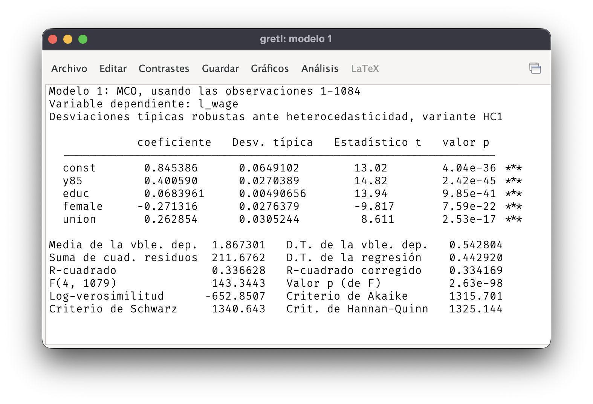
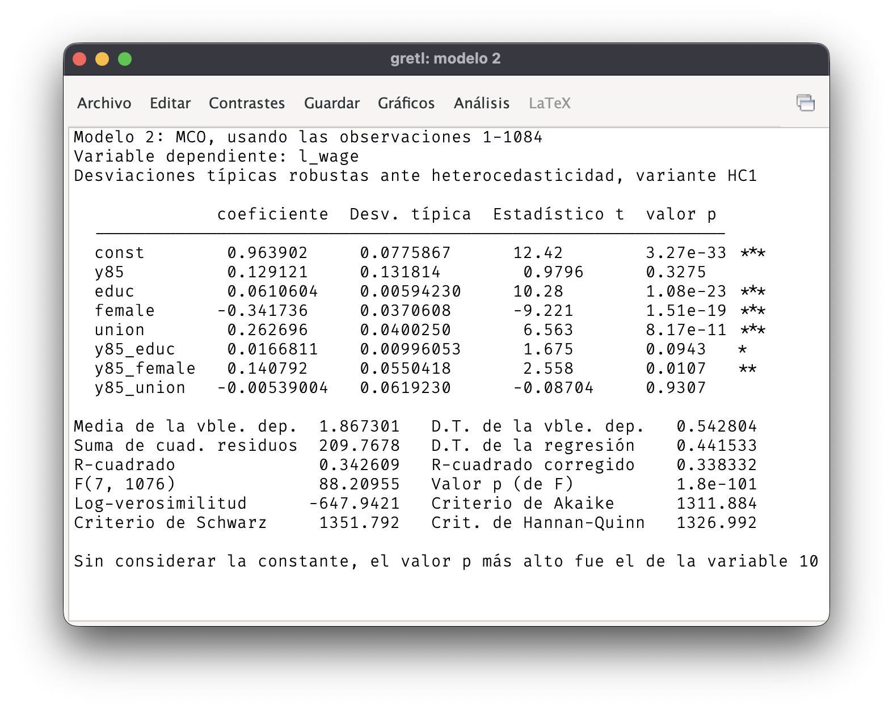
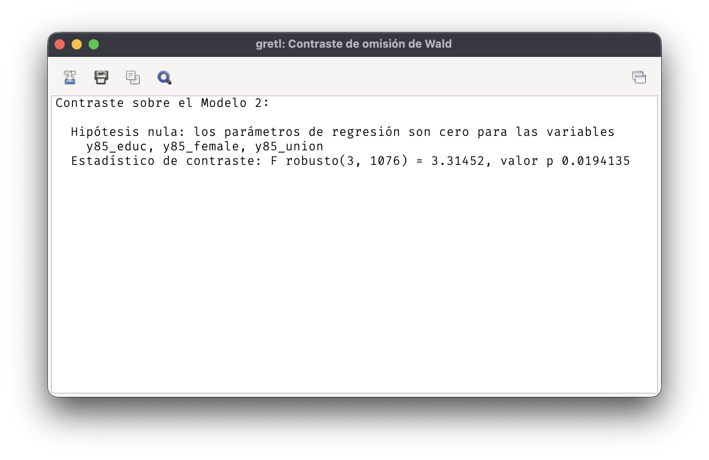
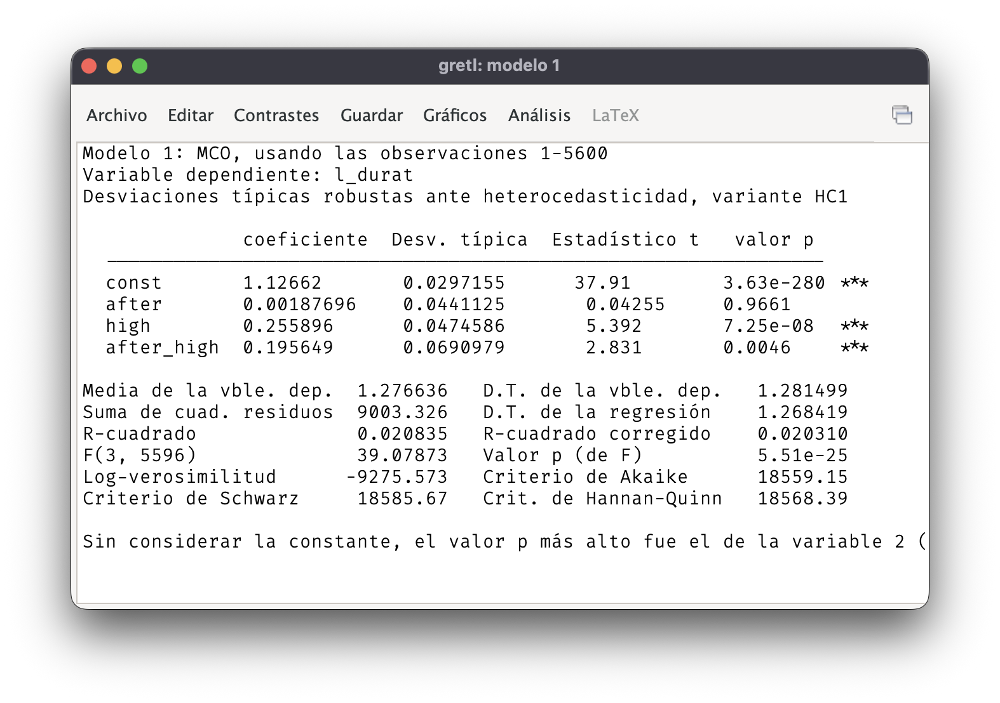
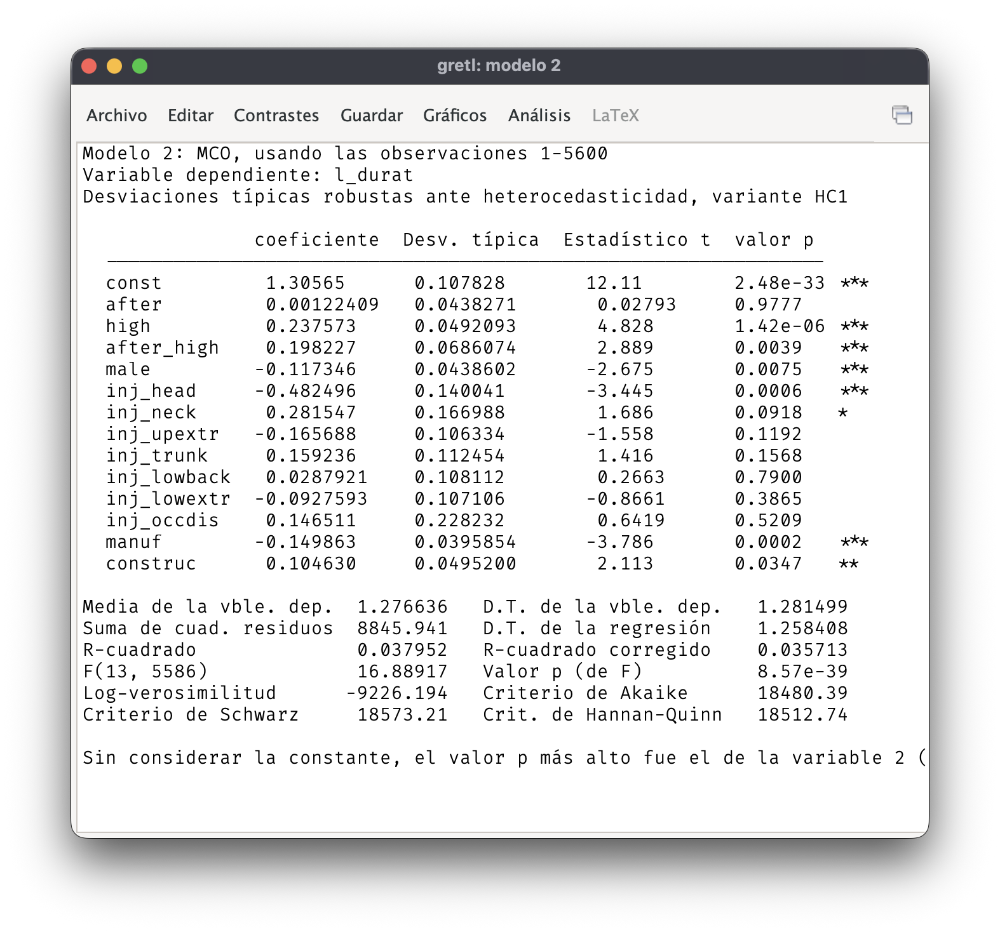

## Evolución de los salarios

::: question
1.  Estime un modelo de regresión donde la variable dependiente es el logaritmo del salario y las explicativas son `y85`, `educ`, `female`, y `union`. Presente la tabla de regresión con errores típicos robustos a heteroscedasticidad.
:::

Resultados de la estimación MCO con errores típicos robustos a la heteroscedasticidad:

{fig-align="center"}

::: question
2.  Interprete el coeficiente de la variable `y85`. Determine su significación para $\alpha = 5\%$.
:::

El coeficiente de `y85` indica que los salarios crecieron por término medio un $40\%$ entre los años 1978 y 1985, manteniendo constante las restantes variables explicativas.

::: question
3.  Añada al modelo de regresión las interacciones de `y85` con las otras variables explicativas. Obtenga un contraste robusto a heteroscedasticidad de la hipótesis de que las pendientes de `educ`, `female` y `union` se mantienen constantes a lo largo del tiempo. Utilice un nivel de significación $\alpha = 5\%$.
:::

Resultados de la estimación cuando se añaden las interacciones:

{fig-align="center"}

Los coeficientes de las interacciones muestran cómo cambian las pendientes de las explicativas entre los años 1978 y 1985. Si las pendientes se mantienen constantes, los parámetros de todas las interacciones son iguales a 0:

$$H_0: 
\beta_{\mathrm{y85\_educ}} = 
\beta_{\mathrm{y85\_female}} =
\beta_{\mathrm{y85\_union}} = 0.$$ La hipótesis alternativa es que al menos uno de los parámetros de las interacciones sea distinto de 0.

El valor de la F es demasiado elevado para ser compatible con la hipótesis nula. En concreto, el valor-$p$ es inferior al nivel de significación, $\alpha = 5\%$, por lo que se rechaza que las pendientes no hayan cambiado durante el periodo muestral.

## Cobertura de las prestaciones por accidente laboral

::: question
1.  Utilice un diseño de diferencias en diferencias para examinar el efecto del cambio normativo sobre la duración de las bajas de los trabajadores de salarios altos. Utilice `l_durat` como variable dependiente. Presente la tabla con errores típicos robustos a heteroscedasticidad.
:::

Modelo de regresión:

$$
\log(durat) = \beta_0 + \beta_1\, after + \beta_2\, high + \beta_3\, after \cdot high + u
$$

Resultados de la estimación MCO, usando errores típicos robustos a heteroscedasticidad:

{fig-align="center"}

::: question
2.  Interprete las estimaciones de cada una de las pendientes. ¿Son significativas individualmente al $5\%$?
:::

El parámetro de `after` muestra en qué medida afectó la reforma a la duración de las bajas de los trabajadores con salarios bajos. La estimación indica un efecto muy pequeño, aumento de la duración media en un $0.19\%$, y no significativo al $5\%$, valor-$p = 0.97$.

La pendiente de `high` refleja la diferencia en las duraciones de las bajas de ambos tipos de trabajadores antes de que se introdujera la reforma. El coeficiente estimado muestra que antes de la reforma la duración media de las bajas de trabajadores con salarios altos era un $25.6\%$ superior a la de los trabajadores con salarios bajos. Este coeficiente es significativamente distinto de $0$ para $\alpha = 5\%$ (valor-$p \approx 0$)

Finalmente, la pendiente de la interacción indica que la diferencia entre la duración de las bajas de ambos tipos de trabajadores se ensanchó después de la reforma, creciendo un $19.6\%$ adicional. El correspondiente contraste $t$ de significación individual rechaza la hipótesis de que este parámetro sea igual a $0$ (valor-$p = 0.5\% < \alpha = 5\%$).

::: question
3.  Añada el resto de variables a la regresión. ¿Se aprecian cambios importantes en las estimaciones de los parámetros o en sus errores típicos?
:::

Estimación MCO con las restantes variables explicativas:

{fig-align="center"}

No se aprecian cambios importantes ni en las estimaciones de las pendientes de `after`, `high` y `after_high`, ni en sus errores típicos.

::: question
4.  ¿Qué conclusión se puede extraer de las regresiones realizadas acerca de la influencia del cambio normativo en la duración de las bajas?
:::

La reforma solo afectó a la duración de las bajas de los trabajadores con salarios altos, ampliando en aproximadamente un $20\%$ la diferencia respecto a los de salarios bajos. Este resultado se mantiene inalterado incluso cuando se tienen en cuenta diferentes características de los trabajadores, como su sexo, tipo de lesión o sector de ocupación.
