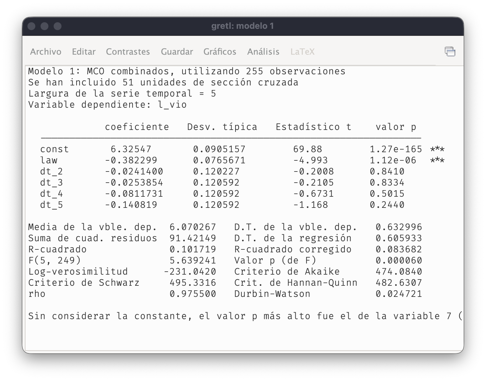
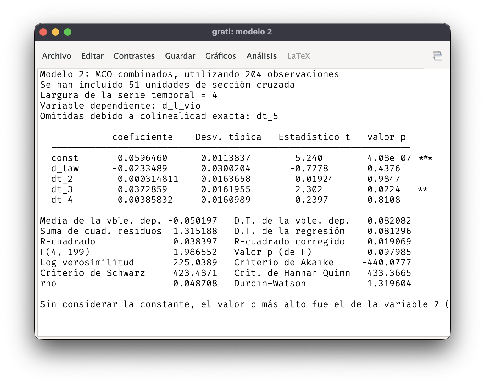
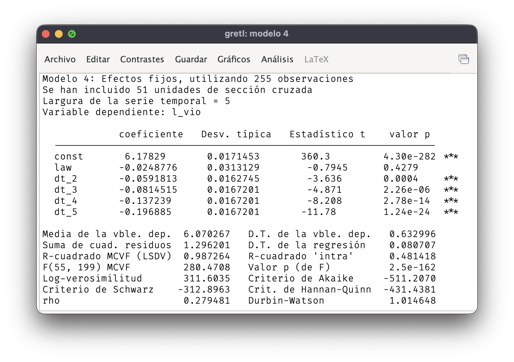
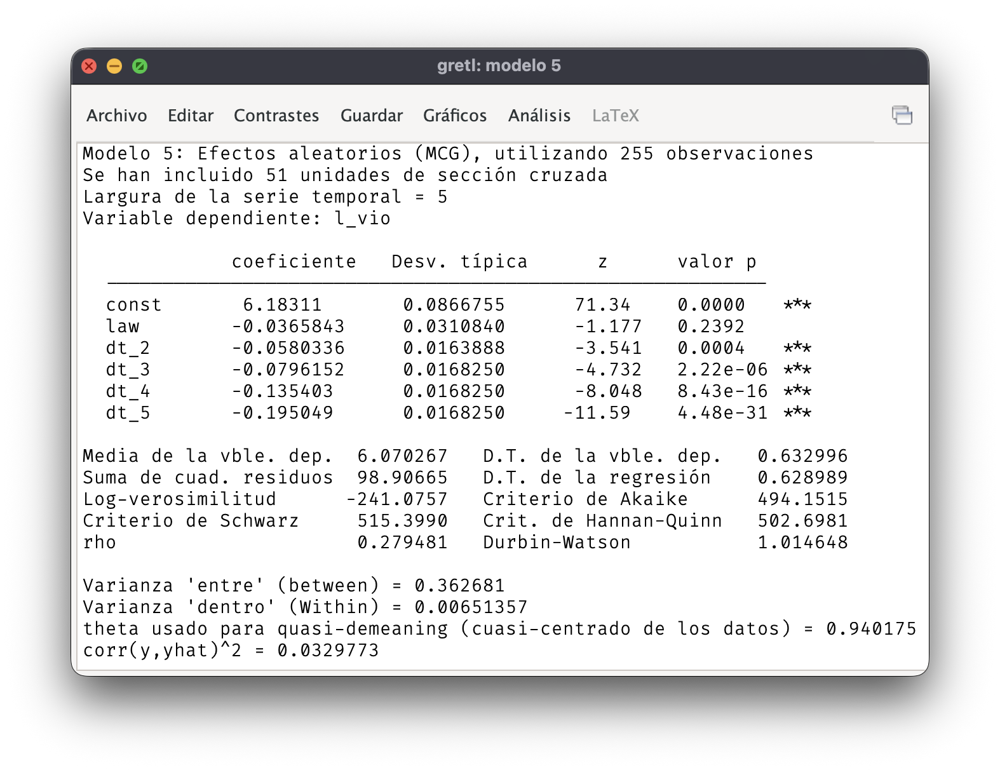

## Bibliografía

-   Básica:

    -   **Wooldridge**: Capítulo 13, secciones 3 a 5, y capítulo 14.

-   Complementaria:

    -   **Stock y Watson**: Capítulo 10.

## Datos de panel con más de dos periodos

-   Modelo de efectos inobservables con $T$ periodos.

-   Modelo con una variable explicativa, $x_{it}$: $$
    y_{it} = \alpha + \delta_2 d2_t + \delta_3 d3_t+ \dots + \delta_T dT_t + 
    \beta x_{it} + a_i + u_{it}
    $$ para $i=1, \dots, N$ y $t = 1, \dots, T$.

-   El parámetro de interés es $\beta$.

------------------------------------------------------------------------

### Muestreo aleatorio

-   Modelo con una variable explicativa, $x_{it}$: $$
    y_{it} = \alpha + \delta_2 d2_t + \delta_3 d3_t+ \dots + \delta_T dT_t + 
    \beta x_{it} + a_i + u_{it}
    $$ para $i=1, \dots, N$ y $t = 1, \dots, T$.

-   Se obtiene una muestra aleatoria en la dimensión transversal. Se observa a los mismos individuos a lo largo de los $T$ periodos.

-   Frecuentemente, $N > T$.

------------------------------------------------------------------------

### Efectos temporales

-   Modelo con una variable explicativa, $x_{it}$: $$
    y_{it} = \alpha + \delta_2 d2_t + \delta_3 d3_t+ \dots + \delta_T dT_t + 
    \beta x_{it} + a_i + u_{it}
    $$ para $i=1, \dots, N$ y $t = 1, \dots, T$.

-   Las variable ficticia $d2_t$ toma valor $1$ cuando $t = 2$, la ficticia $d3_t$ toma valor $1$ cuando $t=3$, etc.

-   Controlan factores que afectan a *todas* las unidades de corte transversal en cada periodo.

------------------------------------------------------------------------

### Efectos individuales

-   Modelo con una variable explicativa, $x_{it}$: $$
    y_{it} = \alpha + \delta_2 d2_t + \delta_3 d3_t+ \dots + \delta_T dT_t + 
    \beta x_{it} + a_i + u_{it}
    $$ para $i=1, \dots, N$ y $t = 1, \dots, T$.

-   Las variable no observable $a_i$ no varía con el tiempo. Toma un valor distinto para cada individuo y ese valor permanece constante en todos los periodos.

------------------------------------------------------------------------

### Error idiosincrático

-   Modelo con una variable explicativa, $x_{it}$: $$
    y_{it} = \alpha + \delta_2 d2_t + \delta_3 d3_t+ \dots + \delta_T dT_t + 
    \beta x_{it} + a_i + u_{it}
    $$ para $i=1, \dots, N$ y $t = 1, \dots, T$.

-   El termino de error idiosincrático, $u_{it}$, es inobservable y tiene variación individual y temporal.

------------------------------------------------------------------------

### Exogeneidad estricta

-   **Exogeneidad estricta**: para cada $i$, el valor esperado del término de error idiosincrático, $u_{it}$, es 0 condicional a los valores de las explicativas en todos los periodos temporales y a la heterogeneidad no observada:\
    $$E(u_{it}| x_{i1}, x_{i2}, \dots, x_{iT}, a_i) = 0.$$

-   Las propiedades de los métodos de panel que se presentarán en este curso dependen de este supuesto.

## MCO con muestras fusionadas

-   Reescribimos el modelo con el término de error compuesto: $$
    y_{it} = \alpha + \delta_2 d2_t + \delta_3 d3_t+ \dots + \delta_T dT_t + 
    \beta x_{it} + v_{it}
    $$donde $v_{it} = a_i + u_{it}$.

-   MCO sólo es consistente cuando no hay correlación entre las explicativas y el efecto individual, $\operatorname{corr}(x_{it}, a_i) = 0.$

------------------------------------------------------------------------

### Ejemplo

-   Relación entre delitos violentos y leyes que permiten portar armas ocultas.

-   Panel de los 51 estados de EE.UU. para los años 1995 a 1999 ($N= 51, T = 5$).

-   `l_vio`: logaritmo de la tasa de crímenes violentos por cada $100\,000$ habitantes en cada estado y cada año.

-   `law`: variable ficticia con valor 1 para los estados que en un determinado año permiten portar armas ocultas.

-   `dt_2`, ..., `dt_5`: variables ficticias temporales.

------------------------------------------------------------------------

## Estimador de la primera diferencia

-   Se toma la primera diferencia temporal para eliminar la heterogeneidad inobservable.

-   Modelo en primera diferencias: $$
    \Delta y_{it} = \delta_2 + \delta_3 d3_t + \dots + \delta_T dT_t + 
    \beta \Delta x_{it} + \Delta u_{it}
    $$ para $i=1, \dots, N$ y $t = 2, \dots, T$.

-   No es necesario que las explicativas estén incorrelacionadas con $a_i$.

------------------------------------------------------------------------

## Estimador de efectos fijos

-   **Transformación intragrupos**: se resta a los valores que toma una variable, la media para cada $i$: $$\ddot{x}_{it} = x_{it} - \bar{x}_i.$$
-   Esta transformación elimina los efectos individuales: $$\ddot{a}_{i} = a_{i} - \bar{a}_i= a_{i} - a_i = 0.$$

------------------------------------------------------------------------

-   El **estimador de efectos fijos** se obtiene aplicando MCO al modelo en diferencias con respecto a las medias: $$
    \ddot y_{it} = \gamma_0 + \gamma_2 d2_t + \dots + \gamma_T dT_t + 
    \beta \ddot x_{it} + \ddot u_{it}
    $$ para $i=1, \dots, N$ y $t = 1, \dots, T$.

------------------------------------------------------------------------

## Estimador de efectos aleatorios

-   Si $\operatorname{corr}(x_{it}, a_i) = 0$, es posible obtener un estimador más eficiente que MCO con la muestra fusionada.

-   Modelo con el término de error compuesto: $$
    y_{it} = \alpha + \delta_2 d2_t + \delta_3 d3_t+ \dots + \delta_T dT_t + 
    \beta x_{it} + v_{it}
    $$donde $v_{it} = a_i + u_{it}$.

-   La presencia de $a_i$ en el error compuesto genera autocorrelación en $v_{it}$.

------------------------------------------------------------------------

-   El estimador de efectos aleatorios pertenece a la familia de MCG.

-   Tiene en cuenta la autocorrelación en el término de error compuesto para obtener un estimador más eficiente.

-   Se obtiene aplicando MCO al modelo en *quasi-diferencias*: $$\tilde{y}_{it} = y_{it} - \lambda \bar{y},$$donde $\lambda$ es un parámetro que depende de la varianza de $u_{it}$, la varianza de $a_i$ y de $T$.

------------------------------------------------------------------------

-   El **estimador de efectos aleatorios** se obtiene aplicando MCO al modelo en diferencias con respecto a las medias: $$
    \tilde y_{it} = \gamma_0 + \gamma_2 d2_t + \dots + \gamma_T dT_t + 
    \beta \tilde x_{it} + \tilde v_{it}
    $$ para $i=1, \dots, N$ y $t = 1, \dots, T$.
-   Cuando $\lambda = 0$, coincide con MCO con datos fusionados.
-   Cuando $\lambda = 1$, coincide con el estimador de efectos fijos.

------------------------------------------------------------------------

## Comparación

-   El estimador de efectos aleatorios y MCO en muestras fusionadas solo son consistentes si las explicativas y los efectos individuales están incorrelacionados.

-   En ese caso, el estimador de efectos aleatorios es más eficiente y sería preferible a MCO con muestras fusionadas.

------------------------------------------------------------------------

-   La consistencia de los estimadores de la primera diferencia y de efectos fijos no depende de la correlación entre las explicativas y los efectos individuales.

-   Cuando $T=2$, los estimadores de la primera diferencia y de efectos fijos son equivalentes.

-   Cuando $T > 2$, los estimadores de la primera diferencia y de efectos fijos difieren y su eficiencia relativa depende de la autocorrelación en el error idiosincrático.
