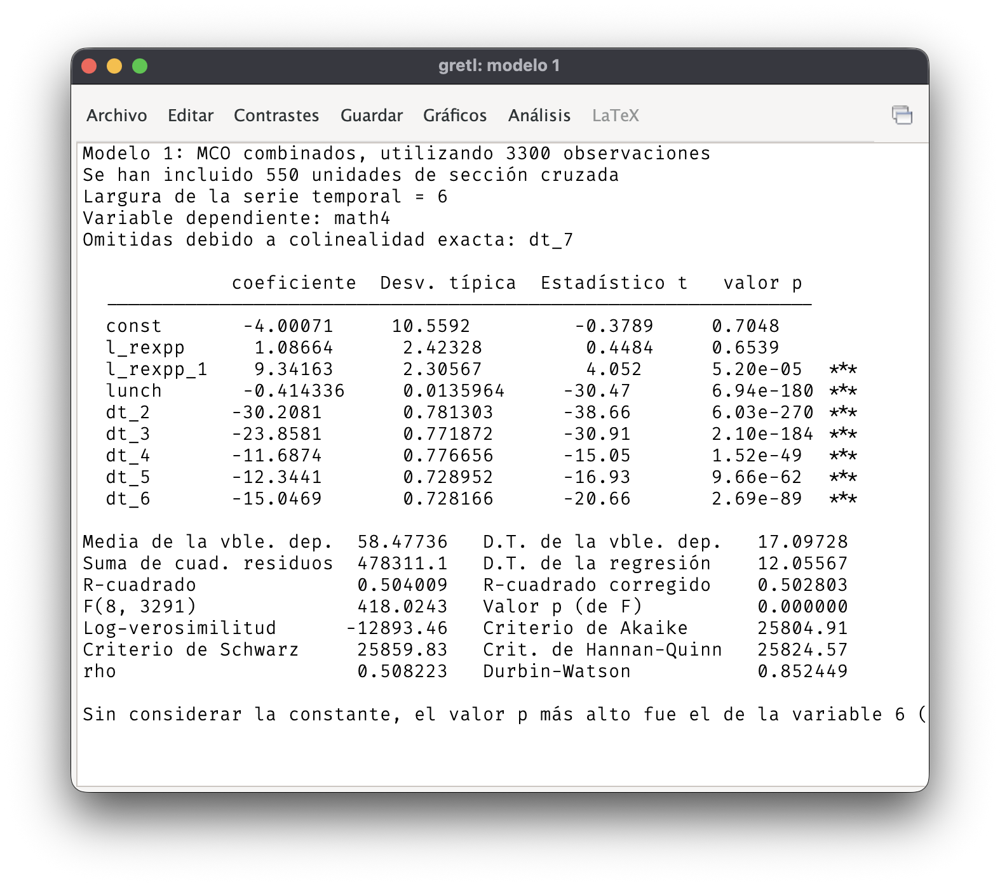
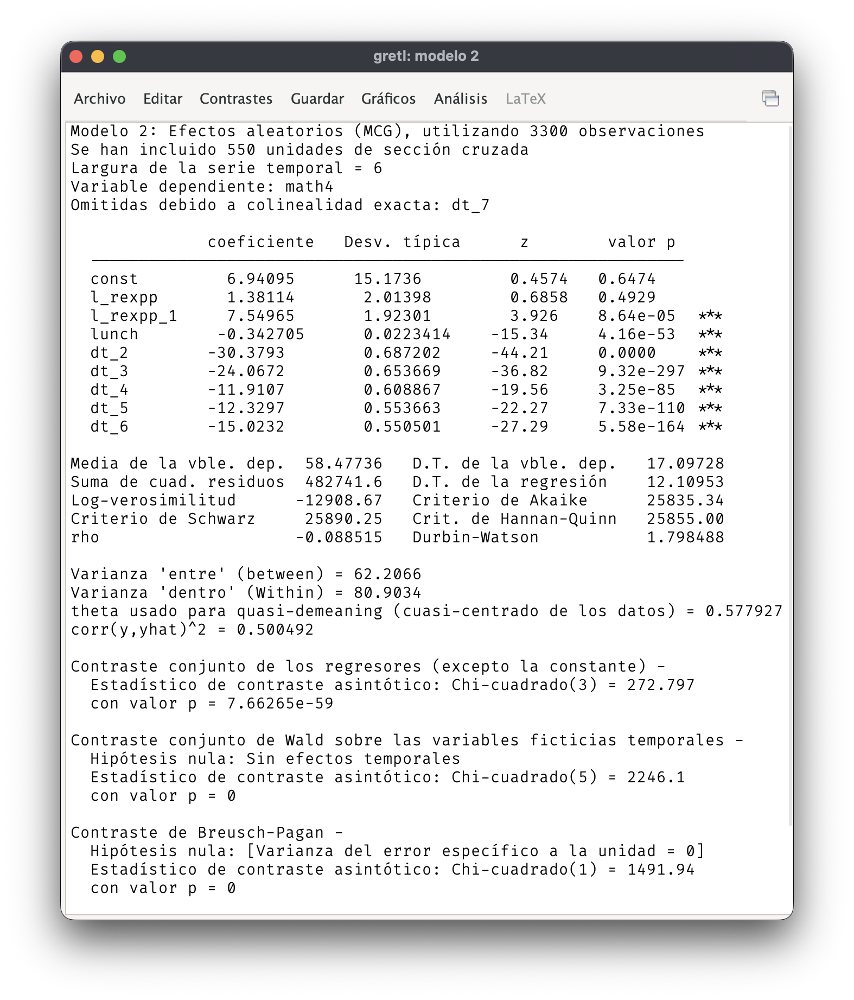
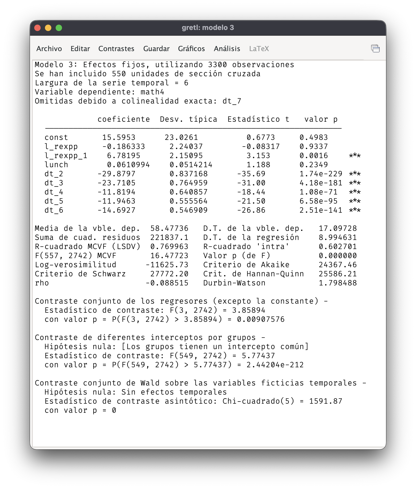
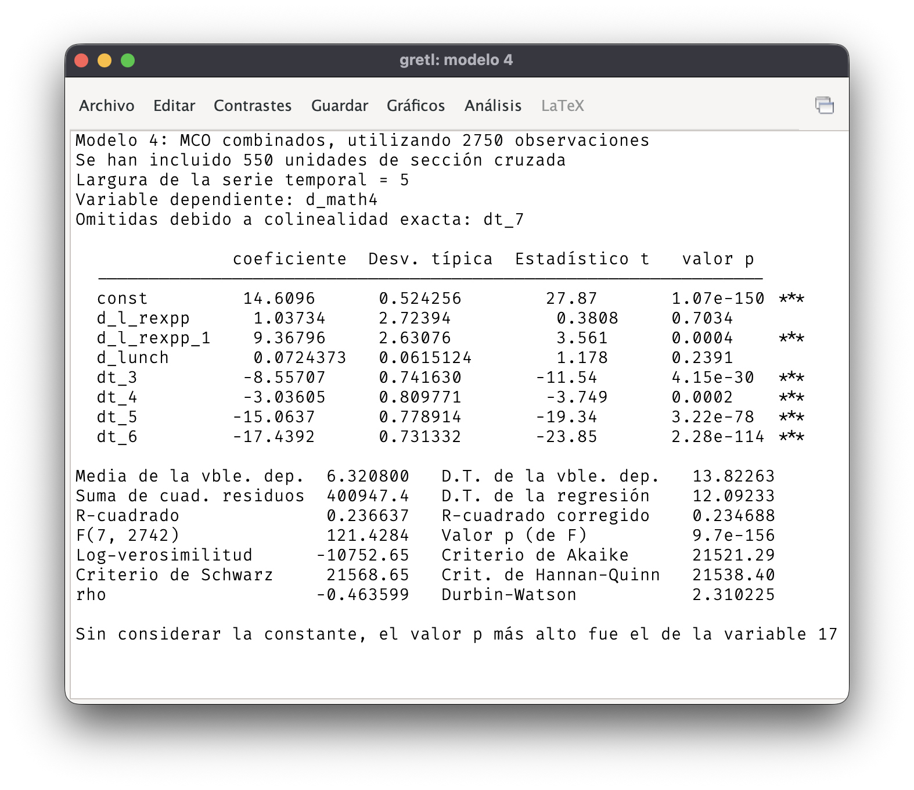

## Gasto en las escuelas y rendimiento de los estudiantes

::: callout-important
Emplee un nivel de significación de $\alpha = 5\%$ en los contrastes de hipótesis y, en su caso, un nivel de confianza del $1 - \alpha = 95\%$ para calcular intervalos de confianza.
:::

::: question
1.  Lea el archivo `meap.xlsx` en Gretl y especifique la estructura de panel de los datos. Cree una variable `l_rexpp` tomando el logaritmo de los gastos de los colegios. Estime por MCO un modelo de regresión donde la variable dependiente es `math4` y las explicativas son `l_rexpp`, un retardo de `l_rexpp`, `lunch` y un conjunto de ficticias temporales. Presente la tabla de regresión. De acuerdo con las estimaciones obtenidas, ¿afectan los gastos escolares durante un curso académico al rendimiento escolar de ese año? ¿Hay algún efecto dinámico de los gastos escolares? Interprete la estimación de la pendiente de `lunch`. ¿Tiene sentido el signo de la estimación de ese parámetro?
:::

{fig-align="center"}

::: question
2.  Utilice el estimador de efectos aleatorios para estimar los parámetros de un modelo con la misma variable dependiente y explicativas. Compare los resultados con los de MCO. ¿Hay grandes diferencias? ¿Cuál de los dos métodos de estimación sería preferible?
:::

{fig-align="center"}

::: question
3.  Aplique el estimador de efectos fijos y compare con los resultados obtenidos con el estimador de efectos aleatorios. ¿Cuándo sería preferible usar uno u otro estimador? De acuerdo con el contraste de Hausman, ¿qué estimador es más adecuado?
:::

{fig-align="center"}

::: question
4.  Finalmente, use el estimador de la primera diferencia y compare los resultados con los obtenidos con el estimador de efectos fijos. ¿Bajo qué condiciones sería preferible el estimador de primeras diferencias al de efectos fijos?
:::

{fig-align="center"}
