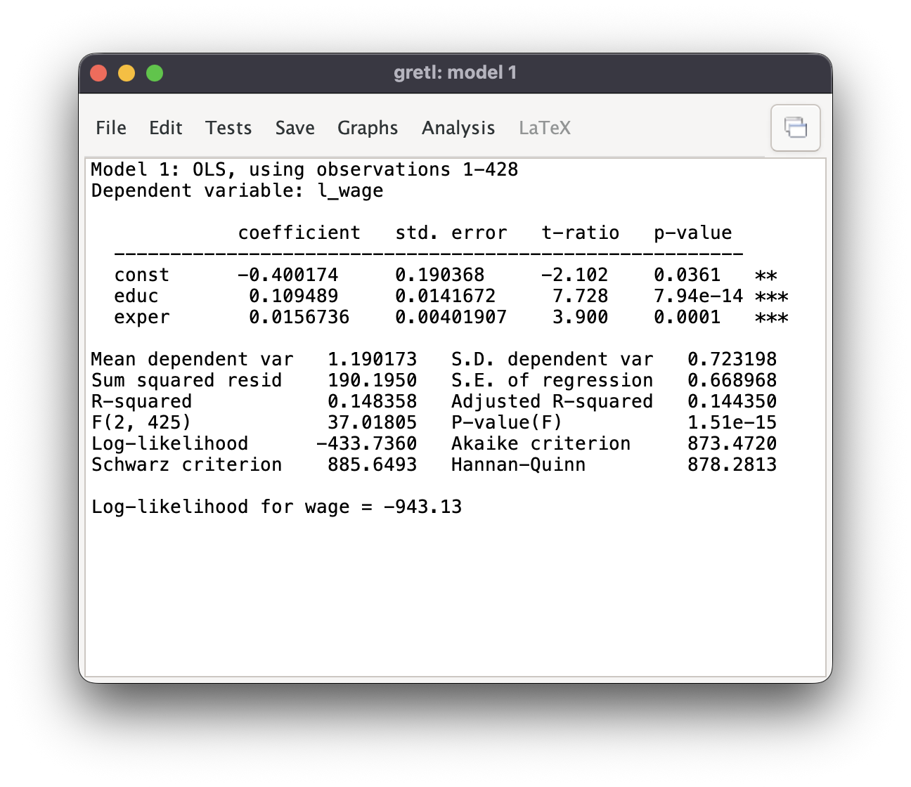
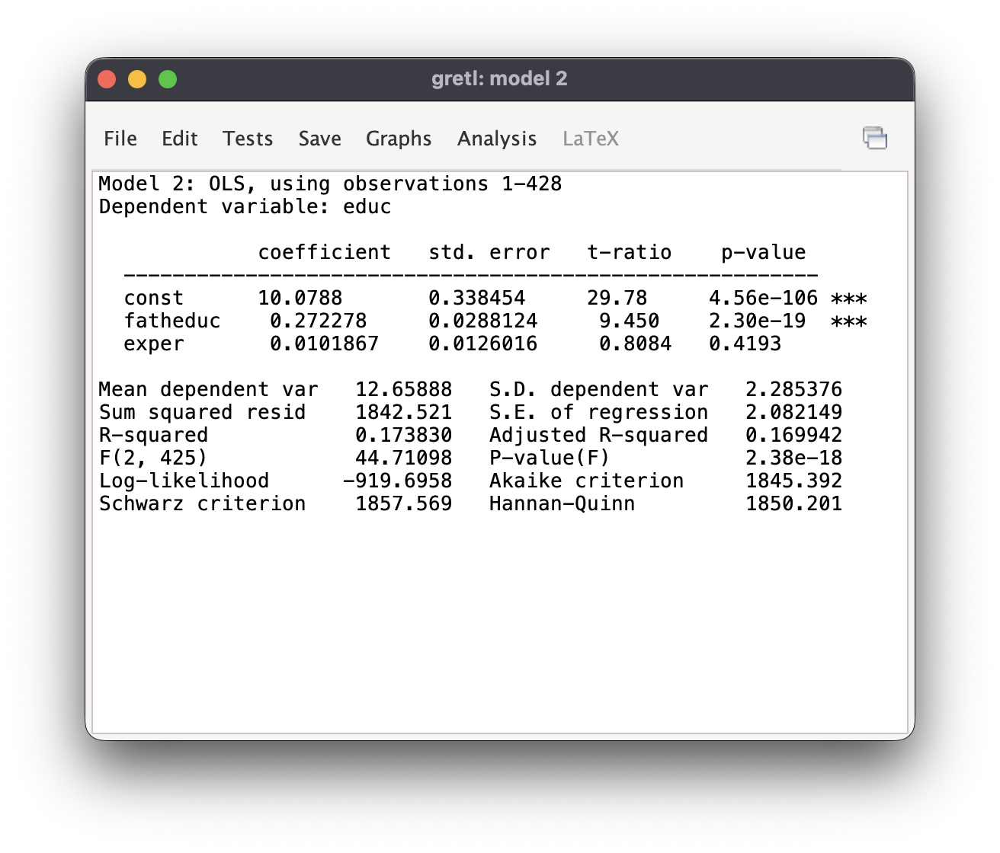
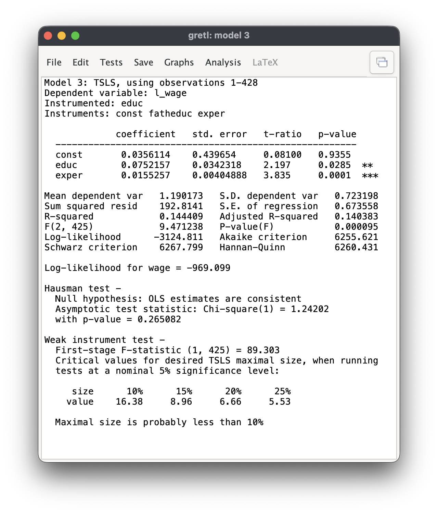
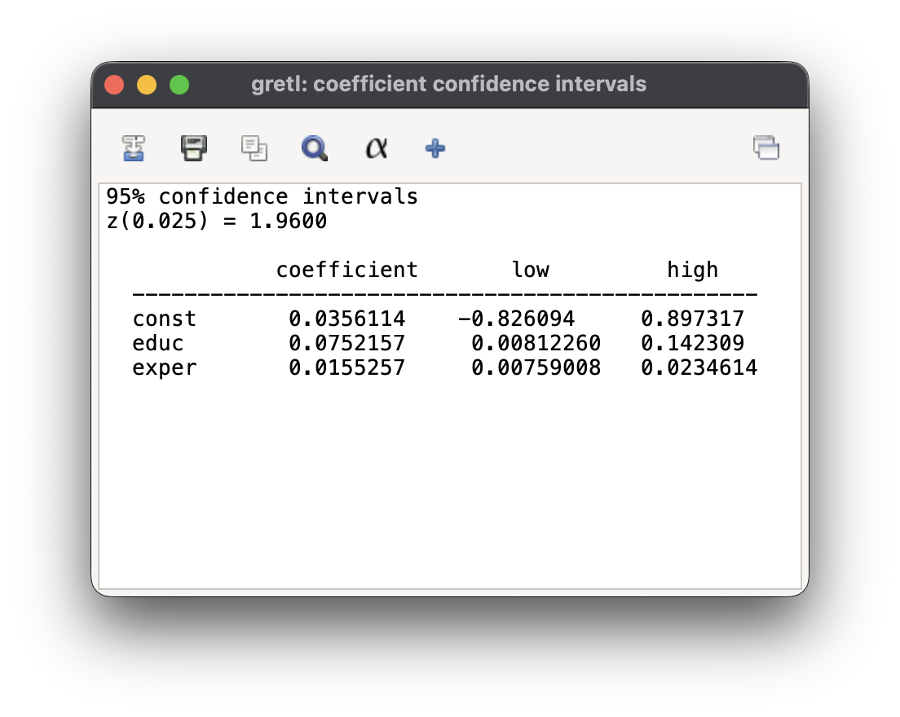

## Bibliografía

-   Básica:

    -   **Wooldridge**: Capítulo 9, sección 2, y capítulo 15.

-   Complementaria:

    -   **Stock y Watson**: Capítulo 12.

## Variables explicativas endógenas

-   Las **variables explicativas exógenas** no están correlacionadas con el el término de error: $E(u_i | z_i) = 0$.

-   Una variable explicativa $x_i$ es **endógena** cuando $E(u_i| x_i) \neq 0$.

-   MCO no es consistente cuando alguno de los regresores es endógeno.

------------------------------------------------------------------------

La endogeneidad puede surgir por:

-   Omisión de variables relevantes.

-   Simultaneidad.

-   Error de medición.

------------------------------------------------------------------------

Algunas soluciones:

-   Análisis del sesgo.

-   Con datos de panel, uso de estimadores que eliminan la heterogeneidad inobservable.

-   Inclusión de variables *proxy.*

-   Otros métodos de estimación: **estimador de variables instrumentales**.

## El estimador de variables instrumentales

-   Modelo de regresión simple: $$y_i = \beta_0 + \beta_1 x_i + u_i.$$

-   La variable $x$ es endógena: $$\DeclareMathOperator{\cov}{cov}\cov(x_i, u_i) \neq 0.$$

-   Para obtener estimadores consistentes de los parámetros, es necesario incluir información adicional.

------------------------------------------------------------------------

### Instrumentos

Una **variable instrumental** cumple dos condiciones:

-   **Exogeneidad**: $\cov(z_i, u_i) = 0$.

-   **Relevancia**: $\cov(z_i, x_i) \neq 0$.

------------------------------------------------------------------------

### Identificación

-   Un **parámetro** está **identificado** si se puede escribir en términos de momentos poblacionales, los cuales puedan ser estimados con una muestra.

-   A partir de $y_i = \beta_0 + \beta_1 x_i + u_i$: $$\cov(y_i, z_i) = \beta_1 \cov(x_i, z_i) + \cov(u_i, z_i).$$

-   Si el instrumento $z_i$ es exógeno y relevante: $$\beta_1 = \frac{\cov(y_i, z_i)}{\cov(x_i, z_i)}.$$

------------------------------------------------------------------------

### Estimación

-   Estimador de la pendiente: $$\hat{\beta}_1 = \frac{
    \sum (y_i - \bar{y}_i) (z_i - \bar{z}_i)}{
    \sum (x_i - \bar{x}_i) (z_i - \bar{z}_i)}.$$

-   Estimador del término constante: $\hat{\beta}_0 = \bar{y} - \hat{\beta}_1 \bar{x}$.

------------------------------------------------------------------------

### Inferencia

-   Homoscedasticidad: $E(u_i^2|z_i) = \sigma^2$.

-   La varianza de $\hat{\beta}_1$ puede estimarse con: $$\mathrm{v\hat{a}r}(\hat{\beta}_1) = \frac{
    \hat{\sigma}^2
    }{
    R^2_{x,z} \sum(x_i - \bar{x})^2
    }.$$

------------------------------------------------------------------------

### Comparación con MCO

-   Si $x_i$ es exógena tanto MCO como VI son estimadores consistentes.

-   En esas condiciones MCO es más eficiente.

-   Cuanto menor es $R^2_{x,z}$ más ineficiente es el estimador VI.

------------------------------------------------------------------------

### Bondad del ajuste

-   Cuando se utiliza el estimador de VI, el $R^2$ no está acotado entre $0$ y $1$.

-   Con VI, el $R^2$ no puede interpretarse como la fracción de la variación total que es explicada por el modelo.

-   El objetivo de VI es obtener estimaciones consistentes de los parámetros, no maximizar el ajuste.

------------------------------------------------------------------------

### Validez de los instrumentos

-   **Instrumento débil**: $z_i$ explica una pequeña parte de la variación de la variable endógena $x_i$.

-   La variable $z_i$ es un instrumento débil cuando $\cov(x_i, z_i)$ toma un valor muy bajo.

-   En el caso extremo $\cov(x_i, z_i) = 0$, la distribución del estimador VI no está bien definida: $$\hat{\beta}_1 \rightarrow  \frac{\cov(y_i, z_i)}{\cov(x_i, z_i)}.$$

------------------------------------------------------------------------

### Regresión de la primera etapa

-   La condición de relevancia puede comprobarse con la **regresión de la primera etapa**: $$x_i = \pi_0 + \pi_1 z_i + v_i.$$

-   La variable $z_i$ es un instrumento relevante si $\pi_1 \neq 0$.

-   Para determinar la relevancia de los instrumentos, se estima por MCO la regresión de la primera etapa. Con una variable endógena, los instrumentos se consideran débiles si el estadístico $F$ para su significación conjunta es menor que $10$.

------------------------------------------------------------------------

### Regresión múltiple

-   Modelo con una explicativa endógena, $y_2$, y dos exógenas, $x_1$ y $x_2$: $$y_1 = \beta_0 + \beta_1 y_2 + \beta_2 x_1 + \beta_3
     x_2 + u$$

-   El método de VI requiere encontrar un instrumento $z$ que cumpla:

    -   Exogeneidad: $\cov(z, u) = 0$.

    -   Relevancia: El parámetro $\pi_1 \neq 0$ en la regresión de la primera etapa: $$y_2 = \pi_0 + \pi_1 z + \pi_2 x_1 + \pi_3 x_2 + u.$$

## Ejemplo

-   Datos usados en T.A. Mroz (1987), “The Sensitivity of an Empirical Model of Married Women’s Hours of Work to Economic and Statistical Assumptions,” *Econometrica* 55, 765-799.

-   Salarios y características de mujeres asalariadas en Estados Unidos en 1975.

------------------------------------------------------------------------

### Variables

-   `l_wage`: logaritmo del salario por hora.

-   `educ`: años en sistema educativo.

-   `exper`: años de experiencia laboral.

-   `fatheduc`: años en sistema educativo del padre.

------------------------------------------------------------------------

### Estimador MCO

{fig-align="center"}

------------------------------------------------------------------------

### Regresión de la primera etapa

{fig-align="center"}

------------------------------------------------------------------------

### Estimador VI

{fig-align="center"}

------------------------------------------------------------------------

### Intervalos de confianza

{fig-align="center"}
