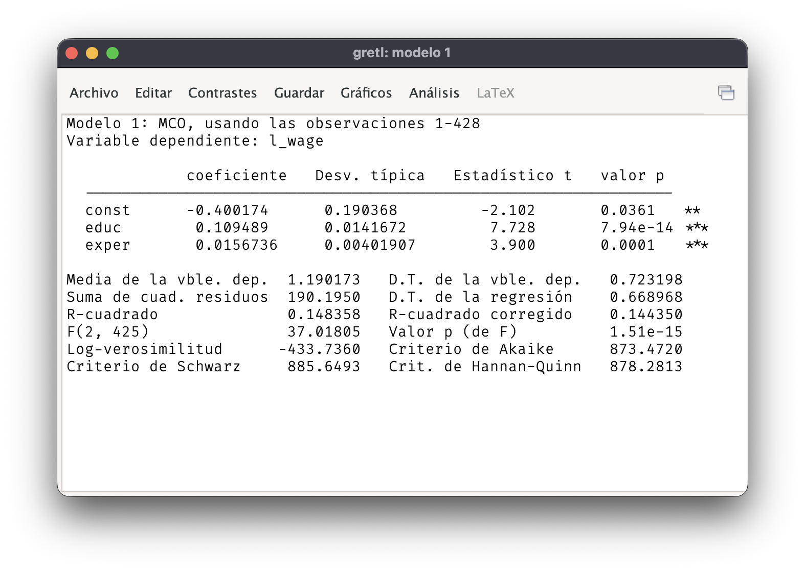
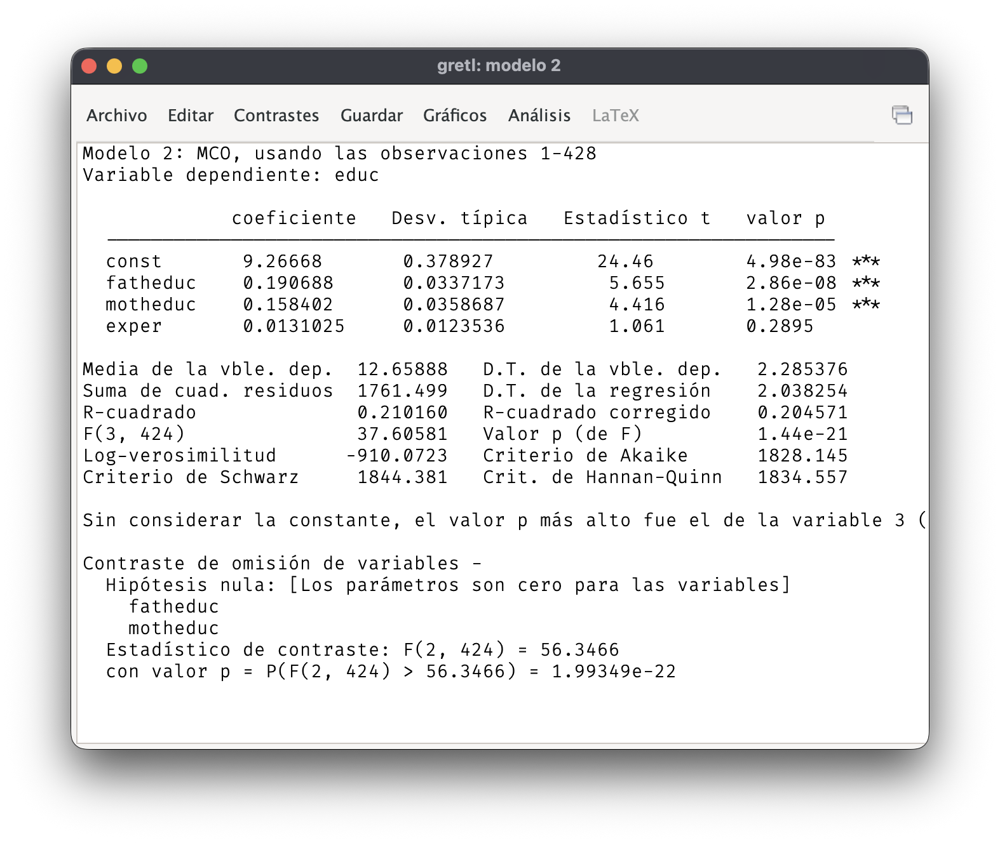
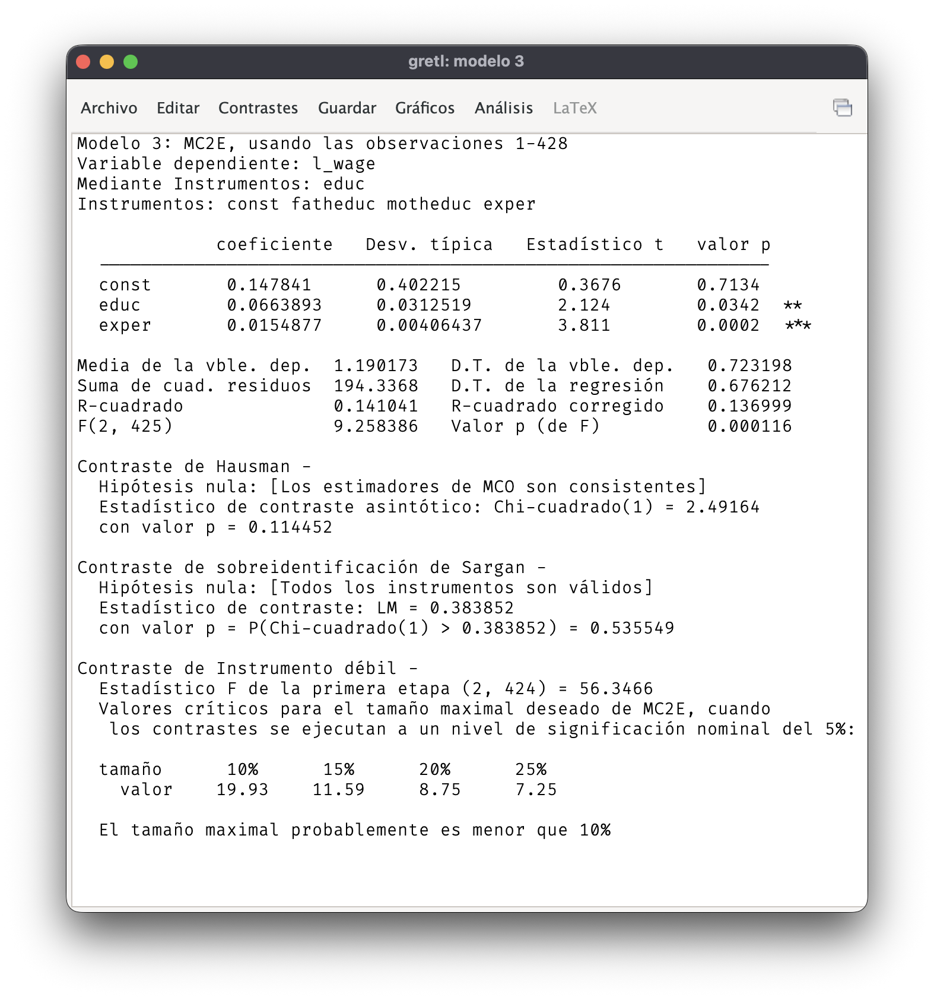
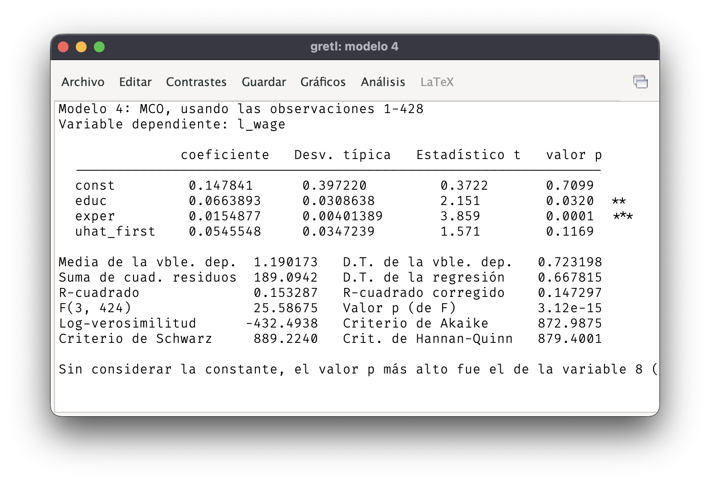
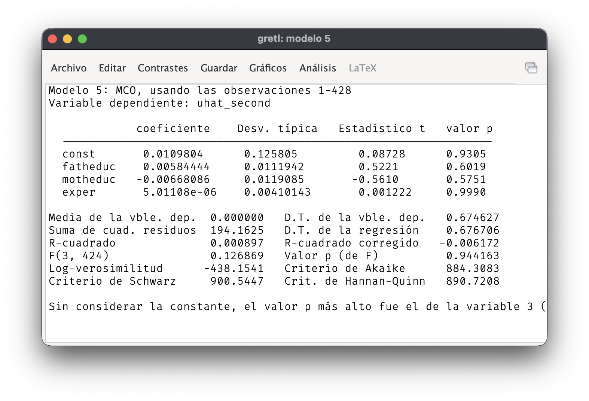

## Bibliografía

- Básica:

  - **Wooldridge**: Capítulo 9, sección 2, y capítulo 15.

- Complementaria:

  - **Stock y Watson**: Capítulo 12.

## Ejemplo

$\newcommand{\Var}[1]{\mathit{#1}}\DeclareMathOperator{\cov}{cov}$

$$\log(\Var{wage}) = \alpha + \beta\,\Var{educ} + \gamma\, \Var{exper} + u,$$

- $\Var{educ}$ es endógena: $\cov(\Var{educ}, u) \neq 0$.

- $\Var{exper}$ es exógena: $\cov(\Var{exper}, u) = 0$.

- Variables instrumentales: $\Var{fatheduc}$ y $\Var{motheduc}$.

------------------------------------------------------------------------

### MCO

{fig-align="center"}

El estimador MCO es inconsistente cuando hay variables explicativas endógenas.

------------------------------------------------------------------------

### Regresión de la primera etapa

$$\Var{educ} = \pi_0 + \pi_1\, \Var{exper} + \pi_2\, \Var{fatheduc} + \pi_3\, \Var{motheduc} + v.$$

- La variable dependiente es la explicativa endógena.

- Los regresores son las explicativas exógenas y los instrumentos.

- Todos los regresores son exógenos, por lo que se puede estimar por MCO.

------------------------------------------------------------------------

### Validez de los instrumentos

$$\Var{educ} = \pi_0 + \pi_1\, \Var{exper} + \pi_2\, \Var{fatheduc} + \pi_3\, \Var{motheduc} + v.$$

- Los instrumentos son válidos si tienen capacidad explicativa en la regresión de la primera etapa.

- Se puede verificar con un contraste $F$ sobre $H_0: \pi_2 = \pi_3 = 0$.

- Valores del contraste $F$ inferiores a $10$ indican que los **instrumentos son débiles**.

------------------------------------------------------------------------

{fig-align="center"}

El contraste $F$ de significación conjunta de los instrumentos es mayor que $10$. Los instrumentos no son débiles.

## Mínimos cuadrados en dos etapas

- Se usa MCO para estimar la regresión de la primera etapa y se obtienen las predicciones de la explicativa endógena.
  $$\Var{ed\hat{u}c} = \hat{\pi}_0 + \hat{\pi}_1 \,\Var{exper} + \hat{\pi}_2 \,\Var{fatheduc} + \hat{\pi}_3 \,\Var{motheduc}.$$

- Se reemplaza la explicativa endógena por su predicción y se estima por MCO:
  $$\log(\Var{wage}) = \alpha + \beta\,\Var{ed\hat{u}c} + \gamma\, \Var{exper} + \mathrm{error}.$$

------------------------------------------------------------------------

- La estimación por MCO de la segunda etapa produce estimadores consistentes de los parámetros.

- Los errores típicos de MCO no son correctos porque no tienen en cuenta que $\Var{ed\hat{u}c}$ se obtiene a partir de una estimación previa.

------------------------------------------------------------------------

{fig-align="center"}

## Contraste de endogeneidad

- Si $\Var{educ}$ no es endógena no sería necesario usar MC2E ya que MCO también sería consistente y más eficiente.

- Contraste de endogeneidad: se incluyen los residuos de la primera etapa, $\hat{v}$, y se estima por MCO.
  $$\log(\Var{wage}) = \alpha + \beta\,\Var{educ} + \theta \hat{v} + \gamma\, \Var{exper} + \mathrm{error}.$$

- Si $\theta = 0$, $\Var{educ}$ es exógena. Esa hipótesis puede contrastarse a partir de la estimación por MCO.

------------------------------------------------------------------------

{fig-align="center"}

## Contraste de sobreidentificación

- **Cuando hay más de un instrumento** es posible contrastar si algún instrumento no es exógeno.

- Se basa en una regresión auxiliar de los residuos de MC2E con respecto a todas las explicativas exógenas y todos los instrumentos.

- Si se cumplen todas las condiciones de exogeneidad, el ajuste de la regresión auxiliar sería prácticamente nulo.

- **Contraste de Sargan**: bajo la hipótesis nula $N R^2 \sim \chi^2$ con grados de libertad iguales al número de instrumentos menos el número de explicativas endógenas.

------------------------------------------------------------------------

{fig-align="center"}

Contraste de Sargan: $428 \times 0.000897 = 0.38$. Valor $p = 0.54$.

## ¿Dónde encontrar buenos instrumentos?

- Teoría económica.

- Encontrar alguna fuente exógena que provoque variaciones en la explicativa endógena.
