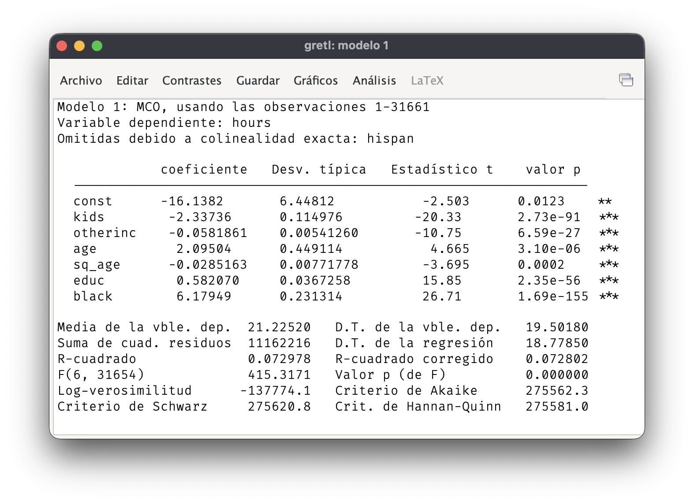
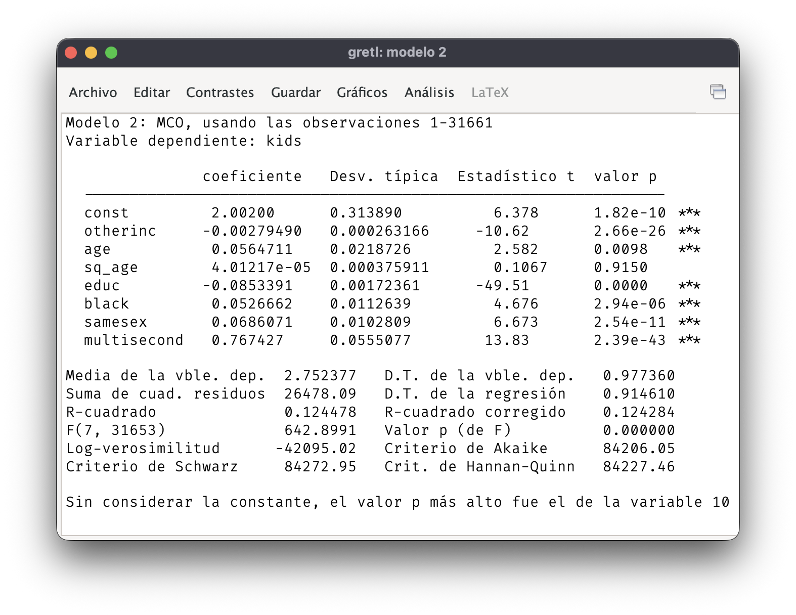
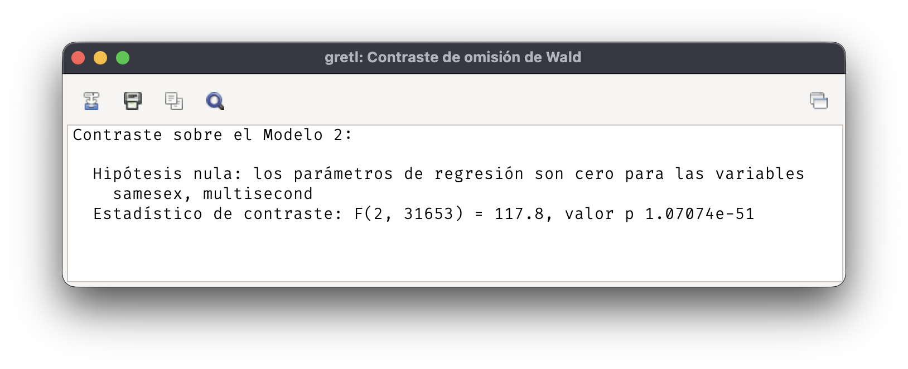
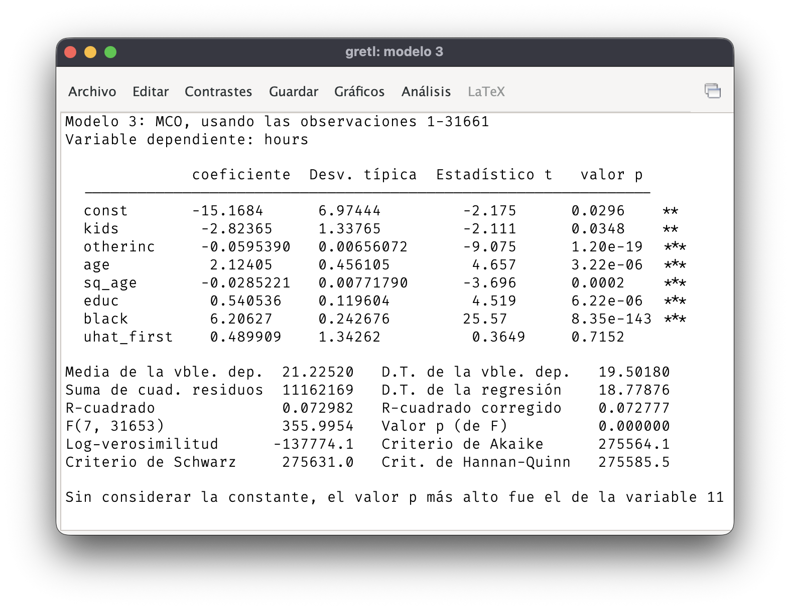
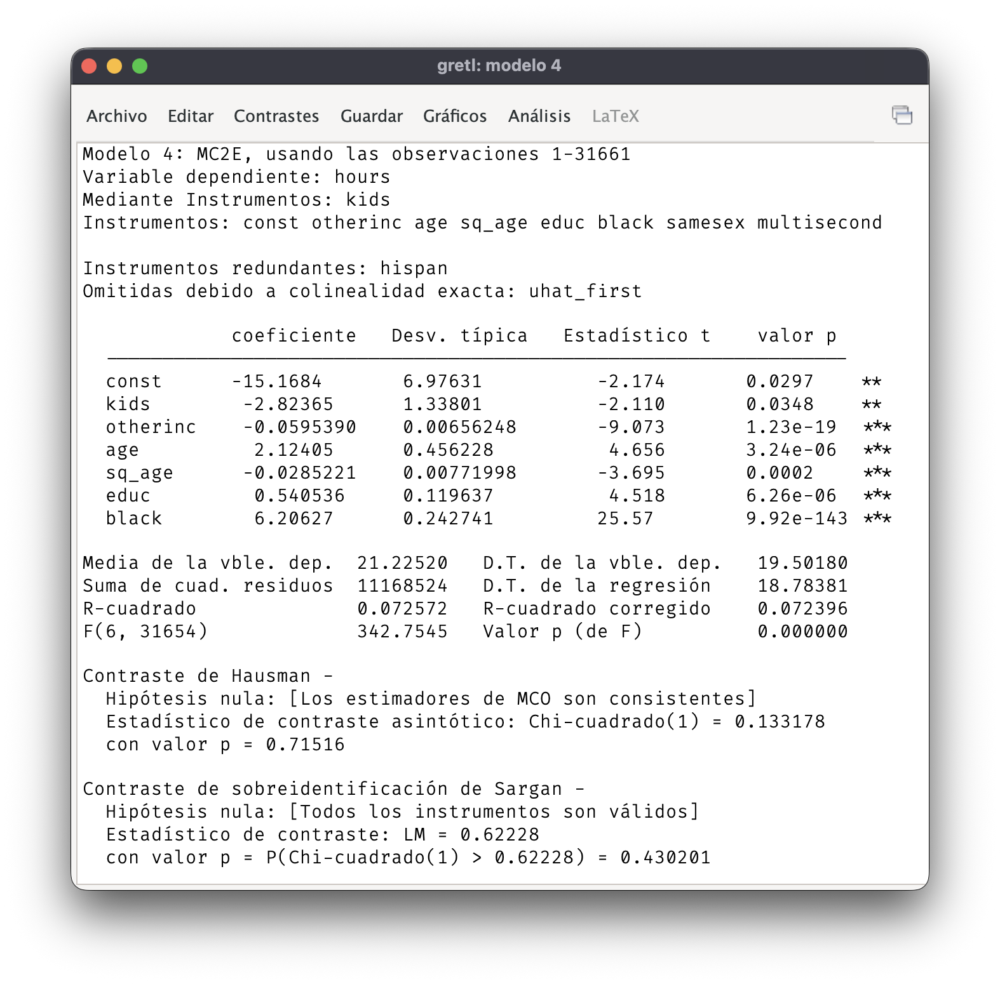

$$\newcommand{\Var}[1]{\mathit{#1}}
  \newcommand{\hours}{\Var{hours}}
  \newcommand{\kids}{\Var{kids}}
  \newcommand{\otherinc}{\Var{otherinc}}
  \newcommand{\educ}{\Var{educ}}
  \newcommand{\age}{\Var{age}}
  \newcommand{\black}{\Var{black}}
  \newcommand{\hispan}{\Var{hispan}}
  \newcommand{\samesex}{\Var{samesex}}
  \newcommand{\multisecond}{\Var{multisecond}}$$

## Oferta de trabajo y fertilidad

### Datos

Los datos del archivo `labsup.xlsx` son un subconjunto de los datos utilizados en [Angrist y Evans (1998)](https://www.jstor.org/stable/116844)[^1]. La muestra está compuesta por 31661 mujeres casadas, madres de al menos dos hijos, negras o hispanas, residentes en Estados Unidos durante 1990.

[^1]: Angrist, J. D., & Evans and W. N. (1998): "Children and their parents’ labor supply: Evidence from exogenous variation in family size." *The American Economic Review*, *88*(3), 450–477.

- $\hours\,$: horas de trabajo a la semana.
- $\kids\,$: número de hijos.
- $\otherinc\,$: renta familiar no procedente de la madre, miles de dólares.
- $\age\,$: edad de la madre
- $\black\,$: variable ficticia, 1 si la madre es negra.
- $\hispan\,$: variable ficticia, 1 si la madre es hispana.
- $\educ\,$: años de educación de la madre
- $\samesex\,$: variable ficticia, 1 si los dos primeros hijos tienen el mismo sexo.
- $\multisecond\,$: variable ficticia, 1 si el segundo parto es múltiple.

### Instrucciones

Se tratará de determinar cómo afecta el número de hijos a la oferta de trabajo de las mujeres, medida con $\hours$, las horas trabajadas por semana. Para ello se plantea el siguiente modelo de regresión:
$$\begin{split}
\hours = \beta_0 + \beta_1\, \kids + \beta_2\, \otherinc   +         \beta_3\, age + \beta_4\, age^2 \\ + \beta_5\, educ + \beta_6\, black +       \beta_7\, hispan + u.
\end{split}$$
 {#eq-1} El parámetro de interés sería $\beta_1$, la pendiente de la variable $\kids$.

Diversas teorías apuntan a que las variables $\hours$ y $\kids$ se determinan simultáneamente en el seno de la familia. En el caso en que $\kids$ sea endógena, la estimación por MCO de los parámetros de la @eq-1 sería inconsistente. Angrist y Evans (1998) utilizaron como instrumentos las variables $\samesex$ y $\multisecond$, ya que estarían relacionadas con cambios exógenos en el número de hijos de naturaleza aleatoria.

::: question
1.  Estime los parámetros de la @eq-1 por MCO. Interprete el coeficiente de $\kids$ y discuta su significación estadística.?
:::

{fig-align="center"}

De acuerdo con la estimación de la pendiente de $\kids$, cada hijo adicional reduce la oferta de trabajo de la madre en algo más de 2 horas a la seman. Este efecto es significativamente distinto de $0$ para un nivel de significación del $5\%$ (valor $p < 0.01$).

Se ha incluido por error la variable ficticia $\hispan$ en la especificación de la oferta de trabajo. Esto provoca una situación de colinealidad perfecta, dado que en todas las observaciones o bien $\black = 1$ o bien $\hispan = 1$. En lo que resta no se utiliza la variable $\hispan$.

::: question
2.  Estime la regresión de la primera etapa en el caso de que $\kids$ sea una variable endógena y se usen $\samesex$ y $\multisecond$ como instrumentos. Utilice esta regresión para determinar si existe un problema de instrumentos débiles.
:::

La variable dependiente en la regresión de la primera etapa es $\kids$. Como explicativas se usan el resto de variables exógenas en la oferta de trabajo y las variables que se usan como instrumentos. Dado que todas las explicativas son exógenas, los parámetros de la regresión de la primera etapa se estiman por MCO.

{fig-align="center"}

El procedimiento habitual para determinar si los instrumentos son débiles es calcular un contraste $F$ de significación conjunta de los instrumentos en la regresión de la primera etapa. Cuando solo existe una variable endógena, se considera que los instrumentos son débiles si el valor del estadístico $F$ es inferior a $10$.

{fig-align="center"}

El contraste de significación conjunta de $\samesex$ y $\multisecond$ produce un estadístico $F = 117.8$, muy superior a $10$. Concluimos que no hay evidencia de que estas variables sean instrumentos débiles para $\kids$.

::: question
3.  Guarde los residuos de la regresión de la primera etapa, inclúyalos como un regresor adicional en la @eq-1 y estime por MCO el modelo ampliado. ¿Hay evidencia sólida de la endogeneidad de $\kids$?
:::

La variable `uhat_first`, que contiene los residuos de la primera etapa, se añade a la regresión del apartado 1 y se estima por MCO el modelo ampliado.

{fig-align="center"}

La endogeneidad de $\kids$ se verifica con un contraste de significación individual de los residuos de la primera etapa. En este caso, el valor absoluto del estadístico $t$ es muy bajo, $0.36$, y no se puede rechazar la hipótesis nula de no significación de los `uhat_first` para $\alpha = 5\%$ (valor $p = 0.715$). Por tanto, no hay fuerte evidencia de que la variable $\kids$ sea endógena en la ecuación de la oferta de trabajo.

::: question
4.  Estime los parámetros de la @eq-1 por mínimos cuadrados en 2 etapas, MC2E, usando $\samesex$ y $\multisecond$ como instrumentos. Compare las estimaciones de los parámetros por MC2E con las obtenidas antes con MCO.
:::

Estimación por mínimos cuadrados en dos etapas:

{fig-align="center"}

Las estimaciones por MC2E son virtualmente idénticas a las que se obtuvieron con MCO, lo que es compatible con los resultados del contraste de endogeneidad del apartado anterior y con el contraste de Hausman que calcula Gretl.

::: question
5.  ¿Cuántas restricciones de sobreidentificación se usan en la estimación MC2E? Utilice un contraste para verificar esas restricciones.
:::

Hay 1 restricción de sobreidentificación ya que se usan 2 instrumentos para 1 variable explicativa endógena. El contraste de Sargan que se recoge en la figura del apartado anterior no rechaza la hipótesis nula al $5\%$ de significación (valor $p = 0.43$), por lo que no hay fuerte evidencia en contra de la validez de los instrumentos.
