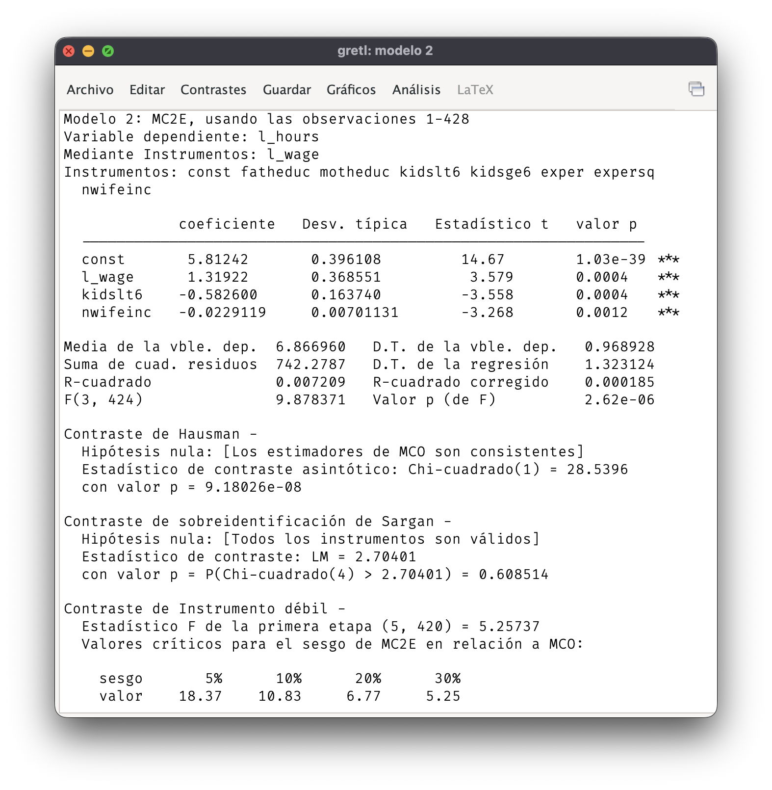
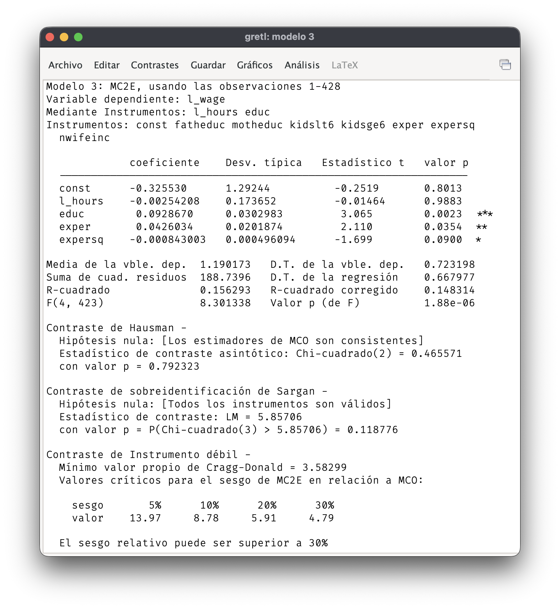
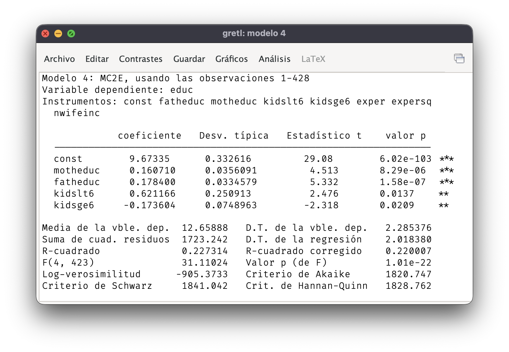

## Bibliografía

-   Básica:

    -   **Wooldridge**: Capítulo 16.

$\newcommand{\xi}{\boldsymbol{x}_i}\newcommand{\Var}[1]{\mathit{#1}}$

## Ejemplo: modelo del multiplicador

-   Modelo del multiplicador en una economía cerrada y sin sector público. **Forma estructural**: $$\begin{align*}C_t &= \alpha + \beta Y_t + u_t \\ Y_t &= C_t + I_t \end{align*}$$

-   Se compone de una ecuación de comportamiento y una identidad.

-   Variables endógenas: $C_t$ e $Y_t$.

-   Variable exógena: $I_t$.

------------------------------------------------------------------------

### Forma reducida

-   **Forma reducida**: cada variable endógena se expresa en función de todas las variables exógenas del sistema.

-   Despejando, obtenemos: $$\begin{align*} C_t &= \frac{\alpha}{1 - \beta} + \frac{\beta}{1 - \beta} I_t + \frac{u_t}{1 - \beta} \\ Y_t &= \frac{\alpha}{1 - \beta} + \frac{1}{1 - \beta} I_t - \frac{u_t}{1 - \beta} \end{align*}$$

------------------------------------------------------------------------

### Identificación

-   Forma reducida: $$\begin{align*}C_t &= \pi_{10} + \pi_{11} I_t + v_{1t} \\ Y_t &= \pi_{20} + \pi_{21} I_t + v_{2t} \end{align*}$$

-   Las ecuaciones de la forma reducida pueden estimarse por MCO ya que todas las explicativas son exógenas.

-   Problema de la identificación: ¿podemos recuperar los parámetros estructurales a partir de los parámetros de la forma reducida?

------------------------------------------------------------------------

### Obtención de los parámetros estructurales

-   Dado que $\pi_{11} = \beta/(1 - \beta)$: $$\beta = \frac{\pi_{11}}{1+ \pi_{11}}.$$

-   También se puede obtener $\alpha$ a partir de los parámetros de la forma reducida: $$\alpha = \frac{\pi_{10}}{1 + \pi_{11}}.$$

-   Por tanto, los parámetros estructurales son identificables a partir de los parámetros de la forma reducida si $\beta \neq 1$.

## Condiciones de identificación

-   El modelo del multiplicador que se ha presentado es el caso más simple de un modelo de ecuaciones simultáneas.

-   Con más ecuaciones estructurales es más complicado resolver las ecuaciones que ligan los parámetros de la forma estructural y los de la forma reducida.

-   Cuando se base en restricciones de exclusión, la identificación se determina comprobando la **condición de orden** y la **condición de rango**.

------------------------------------------------------------------------

### Condición de orden

-   La condición de orden es necesaria para la identificación.

-   En cada ecuación estructural, el número de variables exógenas omitidas debe ser al menos igual al número de variables explicativas endógenas.

-   Si no se cumple la condición de orden, la ecuación no está identificada.

------------------------------------------------------------------------

### Grados de identificación

-   Cuando hay menos variables exógenas omitidas que explicativas endógenas, la ecuación **no está identificada** y no es posible estimar los parámetros de la forma estructural.

-   Si el número de variables exógenas omitidas es igual al número de variables explicativas endógenas, la ecuación está **exactamente identificada**.

-   La ecuación está **sobreidentificada** cuando se omiten más exógenas que el número de variables explicativas endógenas.

------------------------------------------------------------------------

### Condición de rango

-   La condición de rango es una condición suficiente de identificación.

-   En un sistema de dos ecuaciones estructurales, requiere que al menos una de las variables exógenas omitidas en una ecuación tenga un parámetor no nulo en la otra ecuación.

-   En sistemas con más de dos ecuaciones, la condición de rango es más compleja de comprobar.

------------------------------------------------------------------------

### Estimación

- Si las ecuaciones estructurales están identificadas, es posible estimar los parámetros de la forma estructural.

- La estimación puede llevarse a cabo ecuación a ecuación, mediante mínimos cuadrados en dos etapas.

- Pueden obtenerse estimaciones más eficientes estimando todos los parámetros de la forma estructural conjuntamente. Por otro lado, errores de especificación en una ecuación pueden afectar las estimaciones de las restante ecuaciones. 

## Ejemplo: oferta de trabajo de las mujeres casadas

-   Ver Ejemplo 16.3 de manual de Wooldridge.

-   Tres ecuaciones estructurales: $$\begin{align*}
    \log(hours) &= \beta_{10} + \beta_{11} \log(wage) + \beta_{12} kidslt6 \\ & + \beta_{13} \Var{nwifeinc} + u_1 \\ 
     \log(wage) &= \beta_{20} + \beta_{21} \log(hours) + \beta_{22} educ \\ &+ \beta_{23} exper + \beta_{24} exper^2 + u_2 \\
    educ &= \beta_{30} + \beta_{31} \Var{fatheduc} + \beta_{32} \Var{motheduc} \\ &+ \beta_{33} \Var{klidslt6} + \beta_{34} \Var{kidsge6} + u_3
    \end{align*}$$

------------------------------------------------------------------------

### Variables endógenas

-   $hours$: horas de trabajo durante el año.
-   $wage$: salario por hora.
-   $educ$: años de educación.

------------------------------------------------------------------------

### Variables exógenas

-   $\Var{kidslt6}$ es el número de hijos menores de 6 años y $\Var{kidsge6}$ el número de mayores de 6 años.

-   $\Var{nwifeinc}$: rentas procedentes de otros miembros de la familia.

-   $exper$: años de experiencia laboral.

-   $\Var{fatheduc}$ son los años de educación del padre, mientras que $\Var{motheduc}$ son los de la madre.

------------------------------------------------------------------------

### Condición de orden

-   La primera ecuación tiene una explicativa endógena y omite 5 exógenas, por lo que está sobreidentificada.

-   La segunda ecuación tiene 2 explicativas endógenas y omite 5 exógenas, por lo que también está sobreidentificada.

-   La tercera ecuación no tiene variables endógenas explicativas.

------------------------------------------------------------------------

### Estimación de la primera ecuación

{fig-align="center"}

------------------------------------------------------------------------

### Estimación de la segunda ecuación

{fig-align="center"}

------------------------------------------------------------------------

### Estimación de la tercera ecuación

{fig-align="center"}
