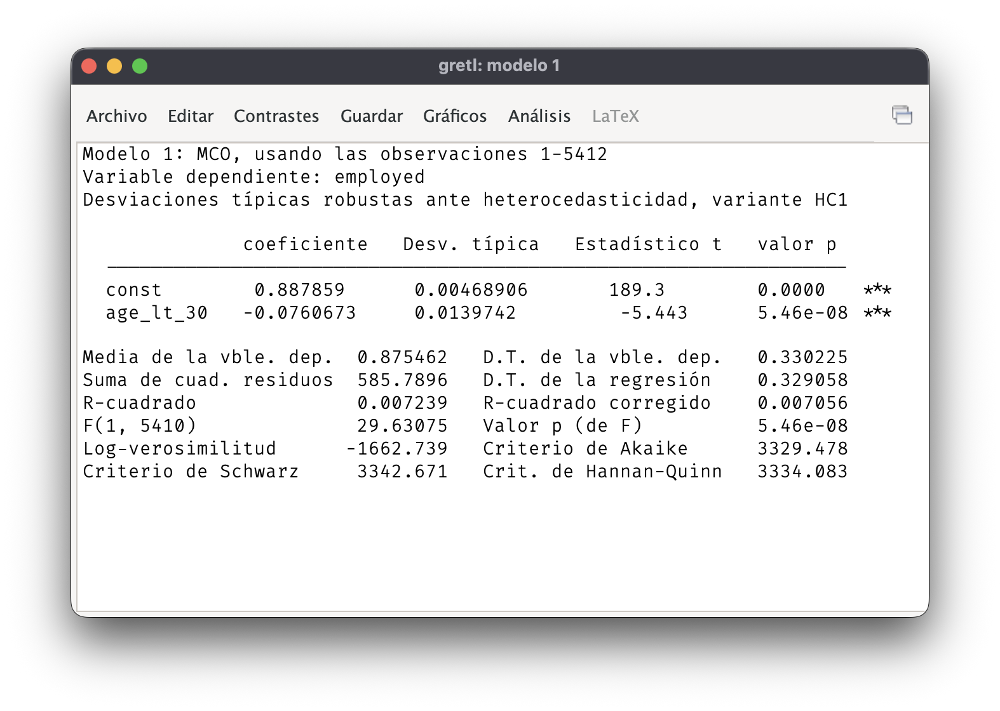
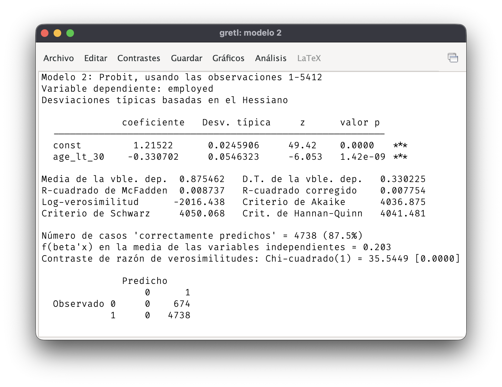
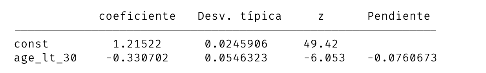
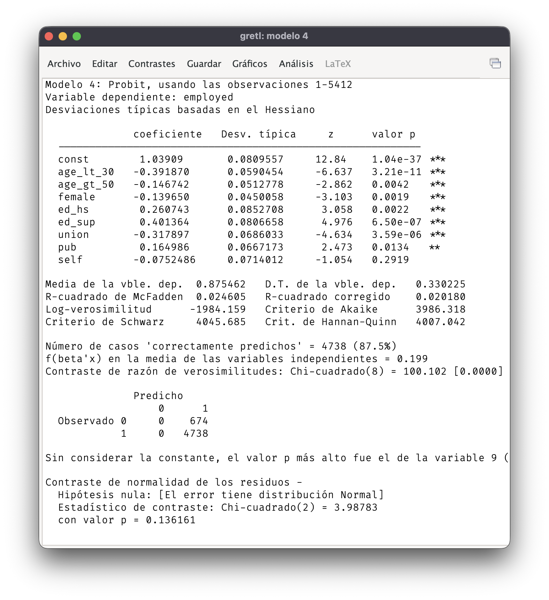
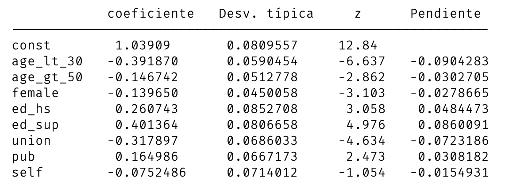
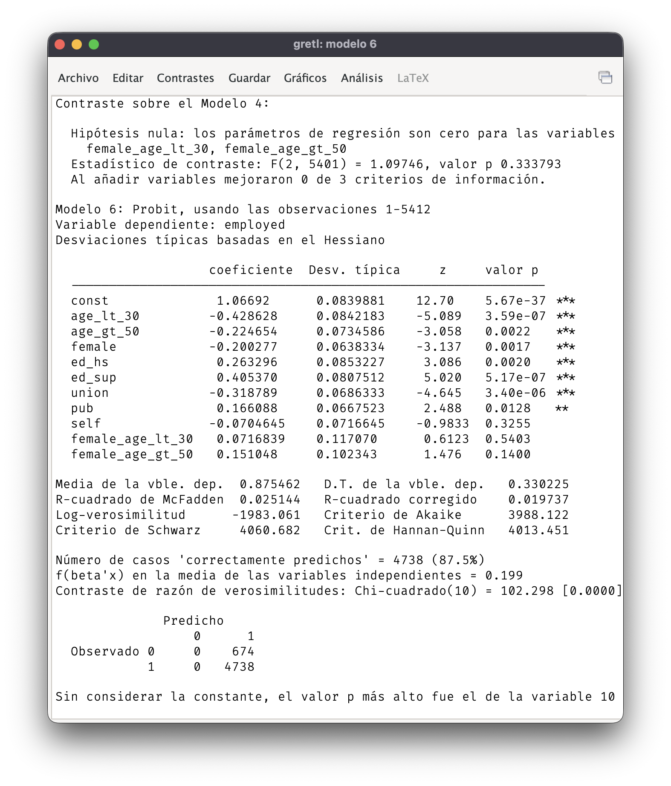

```{r}
#| echo: false

library(knitr)

# Format integers
knit_print.integer = function(x, ...) {
  prettyNum(x, big.mark = "&nbsp;", decimal.mark = ".")
}

registerS3method(
  "knit_print", "integer", knit_print.integer,
  envir = asNamespace("knitr")
)

# Format dates
knit_print.Date = function(x, ...) {
  format(x, "%d %B %Y")
}

registerS3method(
  "knit_print", "Date", knit_print.Date,
  envir = asNamespace("knitr")
)
```

## El empleo en la Gran Recesión

En abril de 2008, la tasa de paro en los Estados Unidos se situó en el 5%. Un año después, en abril de 2009, había ascendido al 9%. Mediante el uso de modelos de probabilidad, se tratará de determinar si algunos grupos de trabajadores fueron más propensos a perder su empleo. En concreto, se estudiará el impacto de la Gran Recesión sobre el empleo de los trabajadores jóvenes.

### Datos

Los datos del archivo `empl09.xlsx` son una muestra de corte transversal que contiene información sobre `r I(knit_print(5412L))` trabajadores de Estados Unidos que estaban empleados a tiempo completo en abril de 2008, coincidiendo con el inicio de la Gran Recesión. Todas las variables son ficticias que describen aspectos socioeconómicos de los trabajadores:

-   `employed`: 1 si continuaba empleado un año más tarde, en 2009.

-   `age_lt_30`: 1 si era menor de 30 años.

-   `age_gt_50`: 1 si era mayor de 50 años.

-   `female`: 1 si era mujer.

-   `ed_hs`: 1 si completó la educación secundaria.

-   `ed_sup`: 1 si tenía estudios superiores.

-   `union`: 1 si estaba afiliado a un sindicato.

-   `pub`: 1 si estaba empleado en el sector público.

-   `self`: 1 si era autónomo.

Las categorías omitidas son: edad entre 30 y 50 años (para `age_lt_30` y `age_gt_50`), educación primaria o menos (para `ed_hs` y `ed_sup`) y empleado en una empresa privada (para `pub` y `self`).

### Instrucciones

::: question
1.  Estime por MCO un modelo que explique `employed` con `age_lt_30`. Utilice errores típicos robustos a heteroscedasticidad. Interprete los parámetros y determine su significación estadística. ¿Afectó de forma diferente la Gran Recesión a los trabajadores jóvenes? ¿De qué manera?
:::

{fig-align="center"}

::: question
2.  Estime un modelo probit con `employed` como variable dependiente y `age_lt_30` como explicativa. Interprete los resultados de la estimación y compárelos con los obtenidos con MCO.
:::

{fig-align="center"}

{fig-align="center" width="80%"}

::: question
3.  Amplíe el modelo probit del apartado anterior: además de `age_lt_30`, incluya como explicativas `age_gt_50`, `female`, `ed_hs`, `ed_sup`, `union`, `pub` y `self`. Discuta brevemente la significación de los parámetros y comente los efectos de los diferentes grupos de variables sobre la probabilidad de continuar empleado.
:::

{fig-align="center"}

{fig-align="center" width="75%"}

::: question
4.  Amplíe el modelo probit del apartado anterior para contrastar si el impacto de la edad en el empleo fue diferente para hombres y mujeres.
:::

{fig-align="center"}
